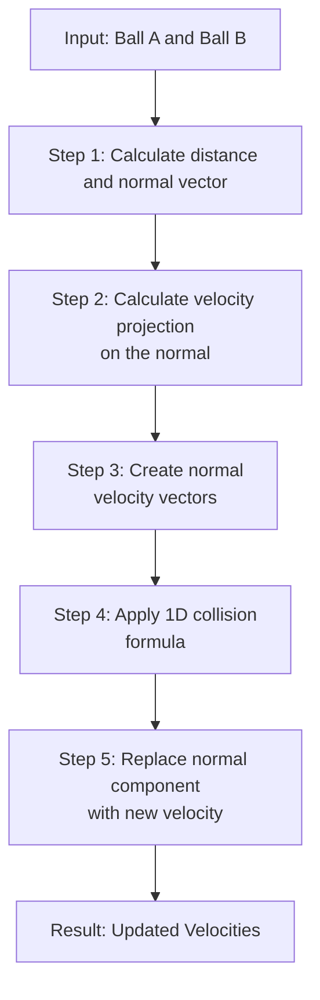

# 2D Elastic Collision Simulation

## Project Overview

This project implements a **2D elastic collision simulation** using the Raylib graphics library. It visualizes multiple balls bouncing and colliding with each other using realistic physics calculations. Collisions are calculated by decomposing the velocity into two components: **normal** (collision direction) and **tangential** (perpendicular).

### Key Features
- ✅ 2D elastic collision physics
- ✅ Multiple objects (up to 100 balls)
- ✅ Real-time visualization with Raylib
- ✅ Wall bounce detection
- ✅ Random ball properties (mass, color, velocity)
- ✅ High-performance C implementation

---

## Code Structure

### Files Overview

#### `include/ball.h` (Header File)
Defines the core data structures and function declarations:

```c
typedef struct vector {
    float x;
    float y;
} vector;

typedef struct object {
    vector position;
    vector velocity;
    float mass;
    float r;        // radius
    Color color;
} ball;
```

**Key functions:**
- `distance()` - Calculate distance between two balls
- `applyVelocity()` - Update ball position based on velocity
- `calcElasticCollision()` - Calculate and apply collision physics

#### `src/ball.c` (Physics Engine)
Implements the collision calculation:
- `calcVelocityA()` - Calculate new velocity for ball A
- `calcVelocityB()` - Calculate new velocity for ball B
- `calcElasticCollision()` - Main collision calculation (5-step process)

#### `src/main.c` (Visualization & Simulation)
Raylib rendering and game loop:
- `generate_balls()` - Create random balls
- `DrawObject()` - Render all balls
- `apply_movement()` - Update positions each frame
- `check_edge()` - Handle wall collisions
- `check_collision()` - Detect ball-to-ball collisions

### Main Simulation Loop
```c
// Initialize window (800x450)
InitWindow(WIDTH, HEIGHT, "Collision Simulation");
SetTargetFPS(60);

// Generate 100 random balls
generate_balls();

// Main loop
while (!WindowShouldClose()) {
    // Update physics
    apply_movement();
    check_collision();
    check_edge();
    
    // Render
    BeginDrawing();
    ClearBackground(BLACK);
    DrawObject();
    EndDrawing();
}

CloseWindow();
```

---

## Compilation & Running

### Prerequisites
- **Compiler:** clang or gcc
- **Raylib:** Graphics library (installed via Homebrew or manually)
- **Make:** Build automation tool

### macOS Installation (Homebrew)
```bash
# Install Raylib
brew install raylib

# Install clang (if not already installed)
xcode-select --install
```

### Compilation

**Option 1: Using Make (Recommended)**
```bash
# Build the project
make

# Run the simulation
make run

# Clean build files
make clean
```

**Option 2: Manual Compilation**
```bash
# Compile source files
clang -Wall -Wextra -std=c99 -Iinclude -g \
  -I/opt/homebrew/include \
  -c src/ball.c -o obj/ball.o

clang -Wall -Wextra -std=c99 -Iinclude -g \
  -I/opt/homebrew/include \
  -c src/main.c -o obj/main.o

# Link object files
clang obj/ball.o obj/main.o -o bin/collision \
  -L/opt/homebrew/lib -lraylib \
  -framework OpenGL -framework IOKit -framework Cocoa

# Run
./bin/collision
```

### Makefile Targets
| Command | Description |
|---------|-------------|
| `make` or `make all` | Compile the project |
| `make run` | Compile and run the simulation |
| `make clean` | Remove build files (obj/ and bin/) |

---

## Troubleshooting

### Raylib not found
If you get a linking error about raylib:
```bash
# Verify Raylib installation
brew list raylib

# Reinstall if needed
brew reinstall raylib
```

### Clang not found
```bash
# Install Xcode Command Line Tools
xcode-select --install
```

### Compilation flags explained
- `-Wall -Wextra` - Enable all warnings
- `-std=c99` - Use C99 standard
- `-Iinclude` - Include headers from `include/` directory
- `-g` - Include debug symbols
- `-lraylib` - Link against Raylib library
- `-framework OpenGL -framework IOKit -framework Cocoa` - macOS frameworks

---

## Detailed Physics Explanation

### Collision Calculation Flow



### Step 1: Normal Vector
Calculation of the normal vector between the centers of the two balls.

**Formula:**
$$\vec{n} = \frac{\vec{AB}}{|\vec{AB}|}$$

### Step 2: Scalar Projection
Projection of each velocity onto the normal vector (dot product).

**Formula:**
$$e_a = \vec{v_a} \cdot \vec{n}$$
$$e_b = \vec{v_b} \cdot \vec{n}$$

### Step 3: Normal Velocity Vectors
Reconstruction of velocity vectors along the normal direction.

**Important:** Only the normal component is kept. The tangential component remains unchanged.

### Step 4: 1D Collision
Calculation of new velocities in 1D using elastic collision formulas.

**Formulas:**
$$a2 = \frac{(m_a - m_b)e_a + 2m_b e_b}{m_a + m_b}$$
$$b2 = \frac{2m_a e_a + (m_b - m_a)e_b}{m_a + m_b}$$

### Step 5: Velocity Update
Replacement of the normal component with the newly calculated velocity.

---

## Numerical Example

Consider two balls with equal mass (1 kg):
- **Ball A:** position (0, 0), velocity (1, 0)
- **Ball B:** position (2, 0), velocity (-1, 0)

1. **Normal:** (1, 0) → collision along X-axis
2. **e_a = 1 × 1 + 0 × 0 = 1**
3. **e_b = -1 × 1 + 0 × 0 = -1**
4. **a2 = (1 - 1)/(1 + 1) × 1 + (2 × 1)/(1 + 1) × (-1) = -1**
5. **b2 = (2 × 1)/(1 + 1) × 1 + (1 - 1)/(1 + 1) × (-1) = 1**

Result: The balls exchange their velocities! ✅
