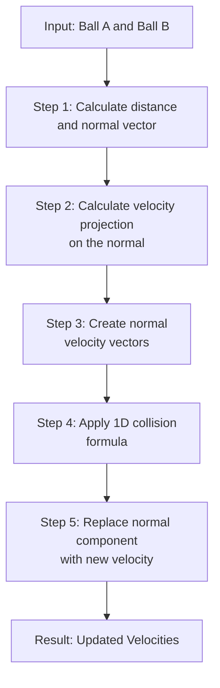
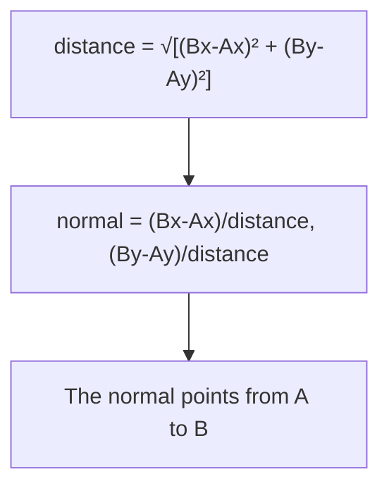
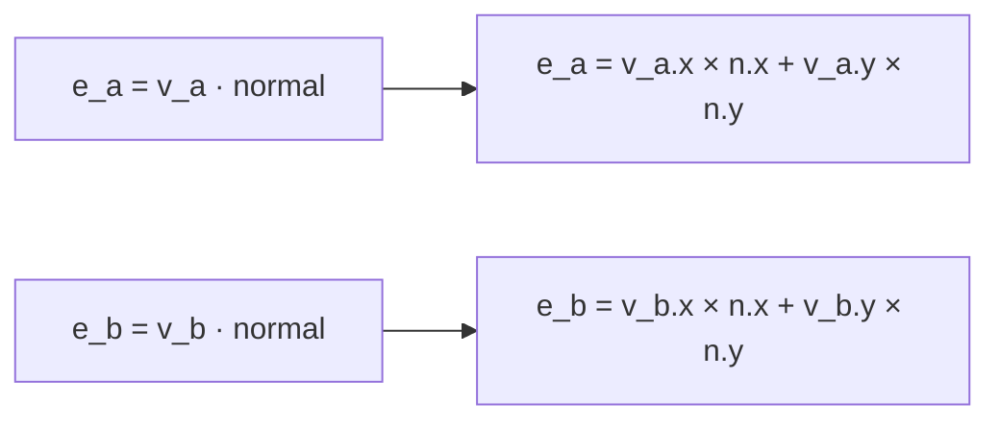
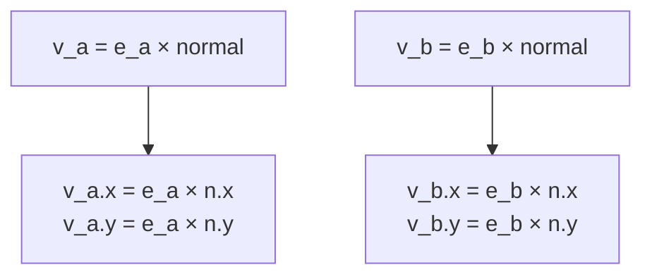
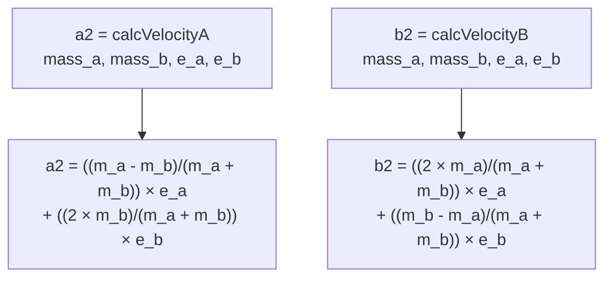
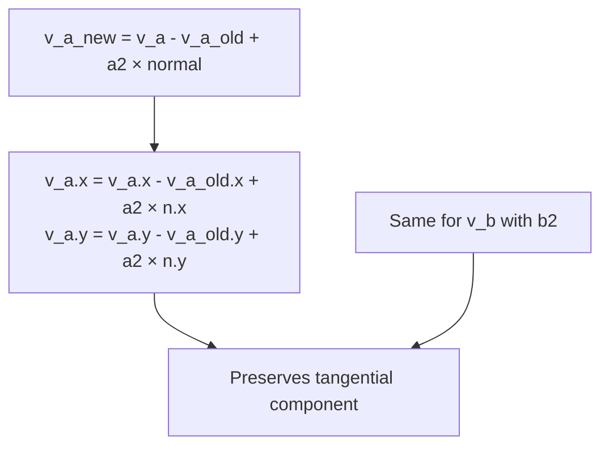
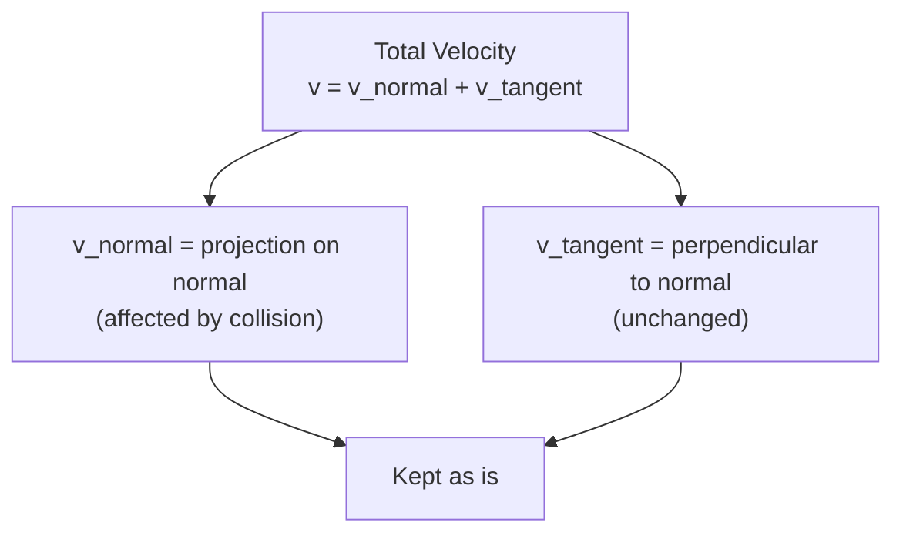

# 2D Elastic Collision Calculation

## Overview

This project implements a 2D elastic collision calculation between two objects (balls) with mass. Collisions are calculated by decomposing the velocity into two components: **normal** (collision direction) and **tangential** (perpendicular).

## Collision Calculation Flow

## Steps Detail

### Step 1: Normal Vector
Calculation of the normal vector between the centers of the two balls.

**Formula:**
$$\vec{n} = \frac{\vec{AB}}{|\vec{AB}|}$$

---

### Step 1 bis: Separate Overlapping Balls

If the sum of radii is greater than the distance between centers, the balls are overlapping. We need to separate them to prevent penetration.

**Condition:**
$$r_a + r_b > \text{distance}$$

**Separation Process:**

1. Calculate the overlap distance:
$$\text{overlap} = (r_a + r_b) - \text{distance}$$

2. Calculate separation distance (half the overlap plus small padding):
$$\text{separation} = \frac{\text{overlap}}{2} + \epsilon$$

where $\epsilon$ is a small padding value (e.g., 0.5 pixels)

3. Move each ball away from the other along the normal direction:
$$A_{\text{new}} = A - \text{separation} \cdot \vec{n}$$
$$B_{\text{new}} = B + \text{separation} \cdot \vec{n}$$

Each ball moves by half the separation distance in opposite directions, restoring the proper spacing.

---

### Step 2: Scalar Projection
Projection of each velocity onto the normal vector (dot product).

**Formula:**
$$e_a = \vec{v_a} \cdot \vec{n}$$
$$e_b = \vec{v_b} \cdot \vec{n}$$

---

### Step 3: Normal Velocity Vectors
Reconstruction of velocity vectors along the normal direction.

**Important:** Only the normal component is kept. The tangential component remains unchanged.

---

### Step 4: 1D Collision
Calculation of new velocities in 1D using elastic collision formulas.

**Formulas:**
$$a2 = \frac{(m_a - m_b)e_a + 2m_b e_b}{m_a + m_b}$$
$$b2 = \frac{2m_a e_a + (m_b - m_a)e_b}{m_a + m_b}$$

---

### Step 5: Velocity Update
Replacement of the normal component with the newly calculated velocity.

---

## Visual Decomposition Diagram

---

## Numerical Example

Consider two balls with equal mass (1 kg):
- **Ball A:** position (0, 0), velocity (1, 0)
- **Ball B:** position (2, 0), velocity (-1, 0)

1. **Normal:** (1, 0) → collision along X-axis
2. **e_a = 1 × 1 + 0 × 0 = 1**
3. **e_b = -1 × 1 + 0 × 0 = -1**
4. **a2 = (1 - 1)/(1 + 1) × 1 + (2 × 1)/(1 + 1) × (-1) = -1**
5. **b2 = (2 × 1)/(1 + 1) × 1 + (1 - 1)/(1 + 1) × (-1) = 1**

Result: The balls exchange their velocities!

